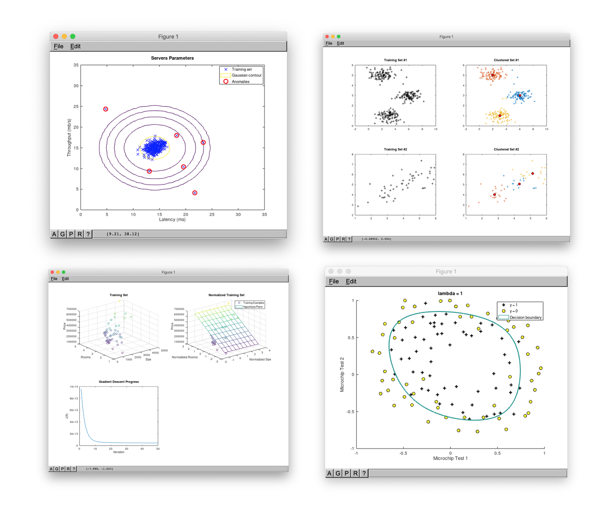

# Machine Learning in MatLab/Octave

> _For Python/Jupyter version of this repository please check [homemade-machine-learning](https://github.com/trekhleb/homemade-machine-learning) project._


This repository contains MatLab/Octave examples of popular machine learning algorithms with code examples and mathematics behind them being explained.

The purpose of this repository was _not_ to implement machine learning algorithms using 3<sup>rd</sup> party libraries or Octave/MatLab "one-liners" _but_ rather to practice and to better understand the mathematics behind each algorithm. In most cases the explanations are based on [this great](https://www.coursera.org/learn/machine-learning) machine learning course.

## Supervised Learning

In supervised learning we have a set of training data as an input and a set of labels or "correct answers" for each training set as an output. Then we're training our model (machine learning algorithm parameters) to map the input to the output correctly (to do correct prediction). The ultimate purpose is to find such model parameters that will successfully continue correct input→output mapping (predictions) even for new input examples.

### Regression

In regression problems we do real value predictions. Basically we try to draw a line/plane/n-dimensional plane along the training examples.

_Usage examples: stock price forecast, sales analysis, dependency of any number, etc._

🤖 [Linear Regression](./linear-regression) - example: house prices prediction.

### Classification

In classification problems we split input examples by certain characteristic.

_Usage examples: spam-filters, language detection, finding similar documents, handwritten letters recognition, etc._

🤖 [Logistic Regression](./logistic-regression) - examples: microchip fitness detection, handwritten digits recognitions using one-vs-all approach.

## Unsupervised Learning

Unsupervised learning is a branch of machine learning that learns from test data that has not been labeled, classified or categorized. Instead of responding to feedback, unsupervised learning identifies commonalities in the data and reacts based on the presence or absence of such commonalities in each new piece of data.

### Clustering

In clustering problems we split the training examples by unknown characteristics. The algorithm itself decides what characteristic to use for splitting.

_Usage examples: market segmentation, social networks analysis, organize computing clusters, astronomical data analysis, image compression, etc._

🤖 [K-means algorithm](./k-means) - example: split data into three clusters.

### Anomaly Detection

Anomaly detection (also outlier detection) is the identification of rare items, events or observations which raise suspicions by differing significantly from the majority of the data.

_Usage examples: intrusion detection, fraud detection, system health monitoring, removing anomalous data from the dataset etc._

🤖 [Anomaly Detection using Gaussian distribution](./anomaly-detection) - example: detect overloaded server.

## Neural Network (NN)

The neural network itself isn't an algorithm, but rather a framework for many different machine learning algorithms to work together and process complex data inputs.

_Usage examples: as a substitute of all other algorithms in general, image recognition, voice recognition, image processing (applying specific style), language translation, etc._

🤖 [Neural Network: Multilayer Perceptron (MLP)](./neural-network) - example: handwritten digits recognition.

## Machine Learning Map


The source of the following machine learning topics map is [this wonderful blog post](https://vas3k.ru/blog/machine_learning/)

## How to Use This Repository

### Install Octave or MatLab

This repository contains `*.m` scripts that are intended to be run in [Octave](https://www.gnu.org/software/octave/) or [MatLab](https://www.mathworks.com/products/matlab.html). Thus in order to launch demos you need either Octave or MatLab to be installed on you local machine. In case of MatLab you may also use its [web-version](https://matlab.mathworks.com/).

### Run Demos

In order to run the demo of your choice you should move to the chosen folder (i.e. `neural-network`):

```bash
cd neural-network
```

Launch Octave console:

```bash
octave
```

Launch demo script from Octave console:

```bash
demo
```

To see all demo variables you may launch:

```bash
whos
```

To exit the demo you may launch:

```bash
exit
```

Also be aware that demo scripts opens additional window with charts and other graphical information that is related to the running algorithm. You may find screenshots of the window that each demo will render for you on the dedicated README files for each machine learning algorithm.


